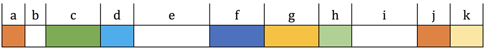
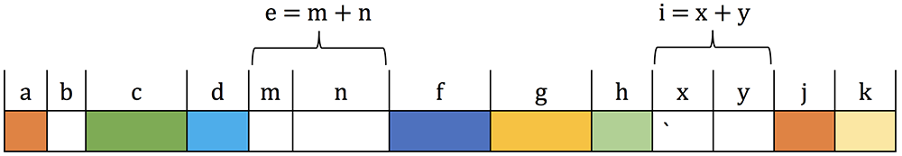

[](https://classroom.github.com/a/RcioOmR7)
# Assignment 9: Memory Management

In this assignment you will implement a memory allocator that uses the memory management techniques
discussed in class. `main.c` contains a main function that tests your allocator. `alloc.h` contains
the definitions used for implementation and testing.

Debugging in this assignment is going to be challenging. We highly recommend you to use `cgdb` to
debug your program as you can readily inspect how you use the heap. Logging will not suffice. If you
need to, go back to [A5](https://github.com/SFU-CMPT-201/a5) and review the `gdb` tutorial once
again. You won't regret using `cgdb` for this assignment.

Before you start the assignment, make sure you `record`.

## Allocator Design Overview

There are two main functions that you need to implement defined in `alloc.h`.

```c
/*
 * alloc() allocates memory from the heap. The first argument indicates the
 * size. It returns the pointer to the newly-allocated memory. It returns NULL
 * if there is not enough space.
 */
void *alloc(int);

/*
 * dealloc() frees the memory pointed to by the first argument.
 */
void dealloc(void *);
```

They correspond to `malloc()` and `free()`. Your job is to implement these two functions that
allocate and deallocate memory for a user program.

In addition, there are two other functions that you need to implement that sets the parameters for
your allocator and gathers the statistics.

```c
/*
 * allocopt() sets the options for the memory allocator.
 *
 * The first argument sets the algorithm. The second argument sets the size
 * limit.
 */
void allocopt(enum algs, int);

/*
 * allocinfo() returns the current statistics.
 */
struct allocinfo allocinfo(void);
```

These functions are inspired by `mallopt()` and `mallinfo()` for `malloc()` that allow you to set
the parameters for `malloc()` and gather statistics.

`alloc.h` has additional definitions and data structures that you need to use for your
implementation. Please check the source before you start implementing your allocator.

Before starting this assignment, it is important to have a clear understanding of how memory
management should work, which is discussed in class. Remember that `alloc()` and `dealloc()` work in
tandem and are not two isolated features. They both rely on the linked list they jointly use.

## `alloc()`

A user program invokes `alloc()` to request a chunk of memory. It expects a single argument that
indicates the memory block size being requested. It should return the pointer to a newly-allocated
chunk. This is basically your own `malloc()`.

Here are the requirements for your implementation.

* Internally, you should use `sbrk()` (which increases the program break) to increase the size of
  the heap. Keep in mind that using `sbrk()` means that you can't use `malloc()` as it also uses
  `sbrk()`. This in turn means that you can't use any other functions that use `malloc()`. For
  example, `printf()` uses `malloc()` internally but `write()` doesn't.
* You should always increase the heap size by `INCREMENT` defined in `alloc.h`. In other words, you
  should not increase the heap size arbitrarily. Instead, you should start by increasing the program
  break by `INCREMENT` for the very first `alloc()` call. If your user program keeps requesting
  memory and you run out of space, then and only then you should increase the program break again by
  `INCREMENT`. A user program can use [`allocopt()`](#allocopt) described below to set the limit on
  how much you can increase the heap size. You should only increase the program break by `INCREMENT`
  if it is within the limit.
* If you run out of space and can't increase the heap size (due to the limit), you should return
  `NULL`.
* If you allocate a block out of a free block, you should split it to create a new free block (as
  discussed in class). The only exception is when, if you performed a split, the remaining size
  would be equal to or less than the header size. If that is the case, you should *not* perform a
  split and just return the entire free block to your user program.
* A user program can use [`allocopt()`](#allocopt) to choose an allocation algorithm. `alloc.h`
  defines the following options.

  ```c
  enum algs { FIRST_FIT, BEST_FIT, WORST_FIT };
  ```

  If a user program selects a particular option, you should allocate memory according to the
  algorithm. As discussed in class, `FIRST_FIT` satisfies the allocation request from the first
  available memory block (according to the linked list described in [`dealloc()`](#dealloc)) that is
  at least as large as the requested size. `BEST_FIT` satisfies the allocation request from the
  available memory block that is at least as large as the requested size and that results in the
  smallest remainder fragment. `WORST_FIT` satisfies the allocation request from the available
  memory block that is at least as large as the requested size and that results in the largest
  remainder fragment.
* Note that these algorithms only differ in how they find a free block. This means that you can
  share much of the code across these three algorithms.

## `dealloc()`

A user program frees a previously-allocated block with `dealloc()`. It expects a single argument
that points to the block to be freed. This is basically your own `free()`.

Here are the requirements for your implementation.

* Internally, you need to keep a linked list of free blocks as discussed in class. This list should
  use the header `struct header` in `alloc.h`.
* This means that you need to implement a custom linked list designed for the purpose of this
  assignment. Note that this is different from a regular linked list as you can't use `malloc()`.
  You need to directly access the heap to maintain your linked list.
* The algorithm for managing this linked list should be exactly as described in class. For example,
  a new free block should be inserted in the head.
* You must coalesce contiguous free blocks (as shown in Figure 1), i.e., if two blocks, one of size
  _m_ and other of size _n_, are consecutive in the heap, they must become a combined block of size
  _m + n_ (as shown in Figure 2). This coalescing must happen when `dealloc()` is called.



_Figure 1: Each block is labeled with its size. White indicates free blocks while allocated blocks
are colored._



_Figure 2: Example with contiguous free blocks. This should never occur as contiguous free blocks
should be merged immediately (as shown in Figure 1)._

## `allocopt()`

* `allocopt()` expects two arguments. The first is the algorithm choice and the second is the limit.
  The algorithm options are the following.

  ```c
  enum algs { FIRST_FIT, BEST_FIT, WORST_FIT };
  ```

* The limit is the ceiling on the heap size. You should only increase the heap size by `INCREMENT`
  when it is within the limit.
* Calling `allocopt()` should serve as a reset point. Thus, if a user program calls `allocopt()`,
  you should reset your allocator to its initial internal state as if there were no
  `alloc()`/`dealloc()` calls at all. This includes (but not limited to) resetting the program break
  to the initial point.
* The test cases always call this first to set the parameters for testing and reset the state.

## `allocinfo()`

* `allocinfo()` should return the current statistics using `struct allocinfo` defined in `alloc.h`.
* The test cases only use `free_size` but other fields are useful to keep track of to check the
  correctness of your implementation.

## Code Structure and CMake

* You need to use the same code structure as A8.
* You also need to write `CMakeLists.txt` that produces a single executable named `main` that runs
  the test cases in `main.c`.
* Similar to A8, you should not hard-code or customize your implementation tailored to our test
  cases. Generally, you should consider the provided test cases as examples or specific instances of
  general cases.

## Grading Distribution

* **You should not change the provided code** as we will replace it for our grading. This can easily
  result in a 0 for the assignment. **Be very careful about this.** You can add your own code/files
  as needed.
* Occasionally, and especially before you submit, make sure that you run the appropriate checker
  (either `checker.amd64` or `checker.arm64`, depending on your platform). As with previous
  assignments, it performs basic checks (e.g., `.record`, `.nvim`, copy-and-paste). If this does not
  pass, you will receive a 0.
* `main.c` contains a main function that tests your allocator. The max score is 390. If you compile
  it and run it, it will give you a score and also tell you which test cases have failed.
* Code that does not compile with CMake gets a 0.
* Code that does not generate all the required executables gets a 0.
* Memory issues have a penalty of -10%. You should use appropriate sanitizers to check for memory
  issues. Make sure you also use the debug option enabled in `CMakeLists.txt` to compile your code
  with debug information for testing. However, your code needs to work without the debug option as
  well. You should remove the debug option when you submit your code.
* A wrong code directory structure has a penalty of -10 pts.

## Acknowledgment

Created by Mohamed Hefeeda, modified by Brian Fraser, Keval Vora, Tianzheng Wang, and Steve Ko.
